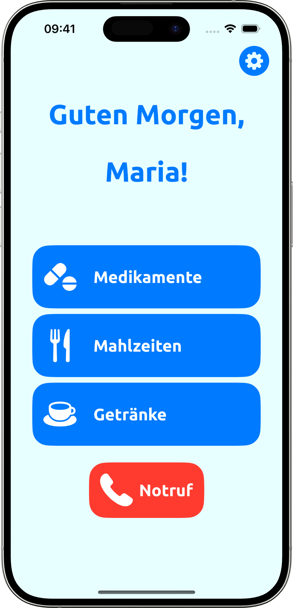
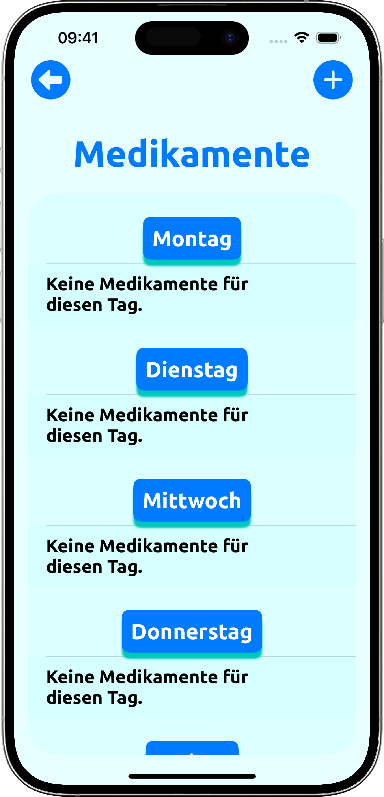
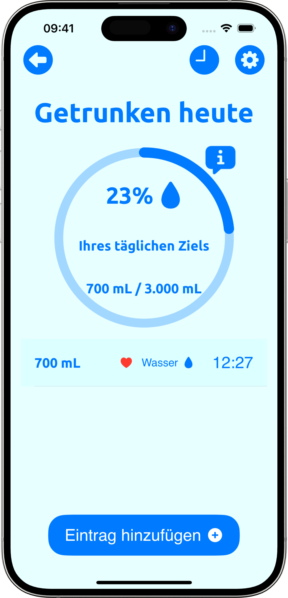

# MediGuard

- [English Version](#english-version)
- [Deutsche Version](#deutsche-version)

## English Version 

**Your health, simply managed**

MediGuard is an app designed specifically for seniors to help them easily document their medications, meals and drinks. With a user-friendly and clear interface, MediGuard ensures that older people can easily track their daily needs.

Who is it suitable for? MediGuard is aimed at senior citizens and their carers. It solves the problem of cluttered medication management and nutritional documentation with a simple, clear design that is easy to use. MediGuard is intuitive and accessible, making it particularly suitable for people with impaired vision or motor skills.

## Design

  
  
  

## Features

- [x] Medication management with reminder function
- [x] Meal and drink log
- [x] Daily drinking targets and documentation
- [x] Daily and weekly meal documentation
- [x] Clear presentation and user-friendliness

## Technical structure

#### Project structure
The project uses the MVVM architecture pattern (Model-View-ViewModel) and the repository pattern for the API to ensure a clear separation of logic and UI. 

#### Data storage
MediGuard stores data with Firebase to ensure reliable and secure cloud synchronisation.

#### API Calls
Introduction
OpenPLZ API is a small open data project that provides a public street directory for Germany, Austria and Switzerland via an open REST API interface. The following data is available:

Germany:
- Street name
- Postcode and town
- Municipality (including information on district, county and federal state)

Austria:
- Street name
- Postcode and town
- Municipality (including details of district and state)

Switzerland:
- Street name
- Postcode and town
- Municipality (including details of district and canton)

The API is used to fill in the place of residence based on the input in an AutoComplete text field.

#### 3rd-Party Frameworks
MediGuard uses the following third-party frameworks:
- SwiftUI for the user interface
- Firebase for data storage and authentication

## Outlook
Describe here where the journey will take you after your practical project. What would you like to add in the future?

- [ ] Integration of health data such as blood pressure and blood sugar
- [ ] Voice recognition for easy data entry
- [ ] Calendar function for daily activities
- [ ] Extended notifications via SMS and e-mail
- [ ] Interactive instructions and video tutorials
- [ ] Integration of wearables and smart home devices for health monitoring
- [ ] Partnerships with hospitals and care services for integration into care processes
- [ ] Customisation of the app for the chronically ill and people with special needs
- [ ] Continuous improvement of data security and data protection measures

## Deutsche Version

**Ihre Gesundheit, einfach verwaltet.**

MediGuard ist eine speziell für Senioren entwickelte App, die ihnen hilft, ihre Medikamente, Mahlzeiten und Getränke einfach zu dokumentieren. Mit einer benutzerfreundlichen und übersichtlichen Oberfläche stellt MediGuard sicher, dass ältere Menschen ihre täglichen Bedürfnisse problemlos nachverfolgen können.

Für wen ist sie geeignet? MediGuard richtet sich an Senioren und ihre Betreuer. Sie löst das Problem der unübersichtlichen Medikamentenverwaltung und Ernährungsdokumentation durch ein einfaches, klares Design, das leicht zu bedienen ist. MediGuard ist intuitiv und zugänglich und daher besonders geeignet für Menschen mit eingeschränkter Sehkraft oder motorischen Fähigkeiten.

## Design

  
  
  

## Features

- [x] Medikamentenverwaltung mit Erinnerungsfunktion
- [x] Mahlzeiten- und Getränkelog
- [x] Tägliche Trinkmengenziele und -dokumentation
- [x] Tägliche und wöchentliche Mahlzeitendokumentation
- [x] Übersichtliche Darstellung und Benutzerfreundlichkeit

## Technischer Aufbau

#### Projektaufbau
Das Projekt verwendet das MVVM-Architekturmuster (Model-View-ViewModel) und das Repository-Pattern für die API, um eine klare Trennung von Logik und UI zu gewährleisten. 

#### Datenspeicherung
MediGuard speichert Daten mit Firebase, um eine zuverlässige und sichere Cloud-Synchronisation zu gewährleisten.

#### API Calls
Einführung
OpenPLZ API ist ein kleines Open Data-Projekt, das ein öffentliches Straßenverzeichnis für Deutschland, Österreich und die Schweiz über eine offene REST-API-Schnittstelle verfügbar macht. Folgende Daten sind abrufbar:

Deutschland:
- Straßenname
- Postleitzahl und Ort
- Gemeinde (inklusive Angaben zu Kreis, Bezirk und Bundesland)

Österreich:
- Straßenname
- Postleitzahl und Ort
- Gemeinde (inklusive Angaben zu Bezirk und Bundesland)

Schweiz:
- Straßenname
- Postleitzahl und Ort
- Gemeinde (inklusive Angaben zu Bezirk und Kanton)

Die API wird verwendet, um den Wohnort anhand der Eingabe in ein AutoComplete Textfield zu befüllen.

#### 3rd-Party Frameworks
MediGuard nutzt folgende Drittanbieter-Frameworks:
- SwiftUI für die Benutzeroberfläche
- Firebase für Datenspeicherung und Authentifizierung

## Ausblick
Beschreibe hier, wo die Reise nach deinem Praxisprojekt hingeht. Was möchtest du in Zukunft noch ergänzen?

- [ ] Integration von Gesundheitsdaten wie Blutdruck und Blutzucker
- [ ] Spracherkennung für einfache Dateneingabe
- [ ] Kalenderfunktion für tägliche Aktivitäten
- [ ] Erweiterte Benachrichtigungen über SMS und E-Mail
- [ ] Interaktive Anleitungen und Video-Tutorials
- [ ] Integration von Wearables und Smart-Home-Geräten zur Gesundheitsüberwachung
- [ ] Partnerschaften mit Krankenhäusern und Pflegediensten zur Integration in Pflegeprozesse
- [ ] Anpassung der App für chronisch Kranke und Menschen mit besonderen Bedürfnissen
- [ ] Ständige Verbesserung der Datensicherheit und Datenschutzmaßnahmen

