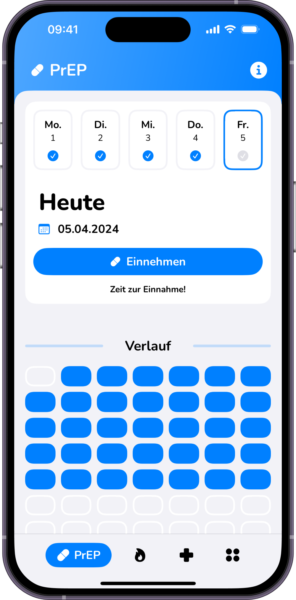
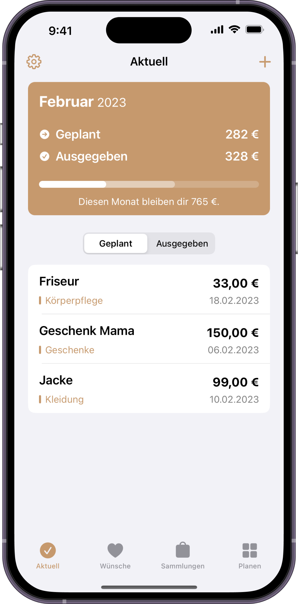

# MediGuard

**Ihre Gesundheit, einfach verwaltet.**

MediGuard ist eine speziell für Senioren entwickelte App, die ihnen hilft, ihre Medikamente, Mahlzeiten und Getränke einfach zu dokumentieren. Mit einer benutzerfreundlichen und übersichtlichen Oberfläche stellt MediGuard sicher, dass ältere Menschen ihre täglichen Bedürfnisse problemlos nachverfolgen können.

Für wen ist sie geeignet? MediGuard richtet sich an Senioren und ihre Betreuer. Sie löst das Problem der unübersichtlichen Medikamentenverwaltung und Ernährungsdokumentation durch ein einfaches, klares Design, das leicht zu bedienen ist. MediGuard ist intuitiv und zugänglich und daher besonders geeignet für Menschen mit eingeschränkter Sehkraft oder motorischen Fähigkeiten.

## Design

  
  
  

## Features

- [x] Medikamentenverwaltung mit Erinnerungsfunktion
- [x] Mahlzeiten- und Getränkelog
- [x] Tägliche Trinkmengenziele und -dokumentation
- [x] Tägliche und wöchentliche Mahlzeitendokumentation
- [x] Übersichtliche Darstellung und Benutzerfreundlichkeit

## Technischer Aufbau

#### Projektaufbau
Das Projekt verwendet das MVVM-Architekturmuster (Model-View-ViewModel) und das Repository-Pattern für die API, um eine klare Trennung von Logik und UI zu gewährleisten. 

#### Datenspeicherung
MediGuard speichert Daten mit Firebase, um eine zuverlässige und sichere Cloud-Synchronisation zu gewährleisten.

#### API Calls
Einführung
OpenPLZ API ist ein kleines Open Data-Projekt, das ein öffentliches Straßenverzeichnis für Deutschland, Österreich und die Schweiz über eine offene REST-API-Schnittstelle verfügbar macht. Folgende Daten sind abrufbar:

Deutschland:
- Straßenname
- Postleitzahl und Ort
- Gemeinde (inklusive Angaben zu Kreis, Bezirk und Bundesland)

Österreich:
- Straßenname
- Postleitzahl und Ort
- Gemeinde (inklusive Angaben zu Bezirk und Bundesland)

Schweiz:
- Straßenname
- Postleitzahl und Ort
- Gemeinde (inklusive Angaben zu Bezirk und Kanton)

Die API wird verwendet, um den Wohnort anhand der Eingabe in ein AutoComplete Textfield zu befüllen.

#### 3rd-Party Frameworks
MediGuard nutzt folgende Drittanbieter-Frameworks:
- SwiftUI für die Benutzeroberfläche
- Firebase für Datenspeicherung und Authentifizierung

## Ausblick
Beschreibe hier, wo die Reise nach deinem Praxisprojekt hingeht. Was möchtest du in Zukunft noch ergänzen?

- [ ] Integration von Gesundheitsdaten wie Blutdruck und Blutzucker
- [ ] Spracherkennung für einfache Dateneingabe
- [ ] Kalenderfunktion für tägliche Aktivitäten
- [ ] Erweiterte Benachrichtigungen über SMS und E-Mail
- [ ] Interaktive Anleitungen und Video-Tutorials
- [ ] Integration von Wearables und Smart-Home-Geräten zur Gesundheitsüberwachung
- [ ] Partnerschaften mit Krankenhäusern und Pflegediensten zur Integration in Pflegeprozesse
- [ ] Anpassung der App für chronisch Kranke und Menschen mit besonderen Bedürfnissen
- [ ] Ständige Verbesserung der Datensicherheit und Datenschutzmaßnahmen

